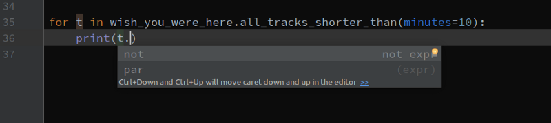
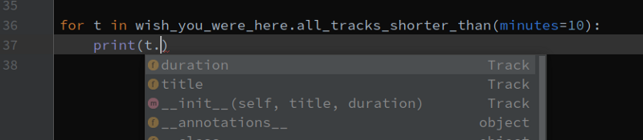
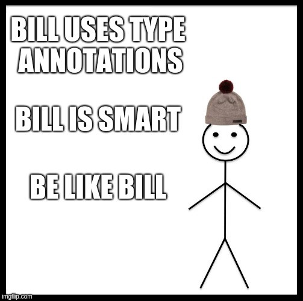

Coming from statically typed languages, C and Java, I felt a little insecure writing Python code. Suddenly, silly type mismatch errors which I was used to catch during compilation were only caught (if at all, in the best case scenario) at runtime. This became especially annoying while learning new APIs or diving into a new large codebase, and made me completely reliant on documentation. While reading the docs is important on its own, I truly missed the comfortable and time-saving code completion on typing ‘.’ using IDEs such as IntelliJ.

Luckily, since Python 3.5, type-annotations have been officially added to Python ([PEP 484][pep-484]), and now we can write something like this:
```python
def hello(name: str) -> None:
    print(f'hello {name}')
```

## Type annotations are optional
While having a different syntax than in C and Java, I find it rather intuitive (at least the simple cases). Importantly, the type annotations are completely optional and are ignored at runtime — meaning:

1. You can’t break the code by adding them (almost — I will elaborate in a future article)
2. They provide no performance gain
3. You may add them only where you see fit — I made myself a balanced rule of always annotating function signatures and module-scope variables, but I usually don’t bother to do so for local variables

## Some benefits of type annotations
With type annotations out there for quite some time, several articles and guides were written about their benefits, of which the most common are:

1. We can employ **static code analysis** to catch type errors prior to runtime— PyCharm does this automatically, highlighting type errors (albeit they are easy to miss in my opinion). Another option, which is definitely recommended, is a useful tool named mypy, which can be run on specific type-annotated files to find type-related errors (I always run it after running my unit tests).
2. **Cleaner code/the code is self-documenting** — as Uncle Bob writes in his (very recommended) book “Clean Code”: “don’t use a comment when you can use a function or a variable”, we can now say “don’t use comments to specify a type, when you can use type annotation”. Comments tend to wear out and rot, while code is alive and must stay fresh. Change the types of the variables without changing the comment specifying the type — nothing happens. Change it without changing the type annotation? Your static analysis tool, whichever it may be, will shout at you.
> “don’t use a comment when you can use a function or a variable”

The other benefit
=================
One important benefit which, as I see it, should tilt your favor towards adopting this new feature if you have resisted it so far, is code completion. Early error-catching and clean code are super important, but I have seen people writing that it is more “pythonic” to write parameter assertions (which include type checking) in the beginning of a function, or that docstrings should be enough. While we can argue about that, the advantages of code completion (of course while using a good IDE, such as PyCharm) are undisputed.

First, let’s see an example of such code completion. Let’s say we are writing a library modeling music objects. We have an Album class and a Track class, and in the Album class we have a method returning all tracks shorter than a specified duration:
```python
class Album:
    def __init__(self, title, artist, release_year, tracks):
        self.title = title
        self.artist = artist
        self.release_year = release_year
        self.tracks = tracks

    def all_tracks_shorter_than(self, minutes=0, seconds=0):
        duration = datetime.timedelta(minutes=minutes, seconds=seconds)
        return [t for t in self.tracks if t.duration < duration]


class Track:
    def __init__(self, title, duration):
        self.title = title
        self.duration = duration
```

Now let’s say I am a user of this library, and I want to print the names of all tracks shorter than 10 minutes in Wish You Were Here (which I instantiated earlier):



Wait a minute, was that variable called ‘name’ or ‘title’? I don’t know that! And the code completion is of no help at all — I must go to the declaration of the Track class or read its documentation — that takes time! This is the best case scenario — what if the programmer does not acknowledge she does not remember the variable name and guesses ‘name’ instead of ‘title’? It will cost even more time because this error will be found only in runtime (hopefully shes use uses TDD and catch it quickly with a pre-written test).

Now what happens if we use type annotations? Let’s add only the minimal type annotation directly needed at the moment:
```python
def all_tracks_shorter_than(self, minutes=0, seconds=0) -> List[Track]:
    duration = datetime.timedelta(minutes=minutes, seconds=seconds)
    return [t for t in self.tracks if t.duration < duration]
```

The return value of this method is a list of Tracks, so we add ‘-> List[Track]’ to its signature (more about the syntax of type annotations). Let’s see what happens now on typing ‘.’:



Great! The IDE now knows what type this variable is, and can recommend the correct attributes — error averted! And the users of this package will have a friendlier time coding with it. Here is how the entire Album class looks like annotated (with my style of annotating):
```python
class Album:
    def __init__(self, title: str, artist: str, release_year: int, tracks: List[Track]) -> None:
        self.title = title
        self.artist = artist
        self.release_year = release_year
        self.tracks = tracks

    def all_tracks_shorter_than(self, minutes: int = 0, seconds: int = 0) -> List[Track]:
        duration = datetime.timedelta(minutes=minutes, seconds=seconds)
        return [t for t in self.tracks if t.duration < duration]
```

Don’t use comments to specify a type, when you can use type annotation
======================================================================
Wrapping up, we’ve seen that type annotations are a great addition to Python — they improve the integrity of the code, they are self-documenting code, and they may improve the productivity of the clients of your code.



### Further reading:
* [How to use static type checking][how-to-type-check]
* [Writing better software with type hints][better-sw-with-hints]

[pep-484]: 			 	https://www.python.org/dev/peps/pep-0484/
[how-to-type-check]: 	https://medium.com/@ageitgey/learn-how-to-use-static-type-checking-in-python-3-6-in-10-minutes-12c86d72677b
[better-sw-with-hints]: http://www.daveoncode.com/2017/03/06/writing-better-software-with-python-3-6-type-hints/